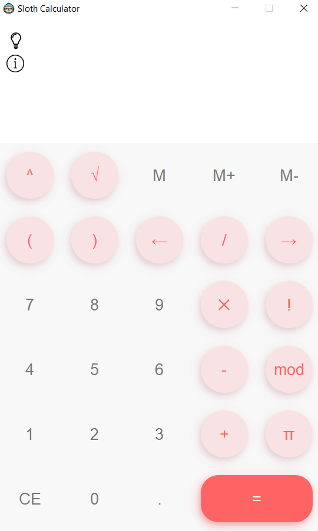

<div align="center">
    <h1>Sloth Calculator</h1>
    <p>
    
    <br>
    </p>
</div>

## IVS Projekt 2 

[](https://www.npmjs.com/package/@toast-ui/editor) [](https://github.com/nhn/tui.editor/blob/master/LICENSE) [](https://github.com/nhn/tui.editor/issues?q=is%3Aissue+is%3Aopen+label%3A%22help+wanted%22) [](https://github.com/nhn)

## About 
Simple calculator with pleasing graphical user interface.
Calculator uses handmade mathematical library and high performace expression parser to bring you the most accurate results.

Authors
------
- xkuzni04 Jakub Kuzník 
- xkrato61 Pavel Kratochvíl 
- xvanom00 Michal Vaňo
- xsvobo1x Lucie Svobodova


## Installation
```
sudo dpkg -i sloth_calc.deb
```

## Uninstallation
```
sudo dpkg -P slothcalc
```

## Built With

* [Python](https://www.python.org/) - The programming language used
* [PyQt](https://wiki.python.org/moin/PyQt) - Used for the GUI

Supported environments
---------
Ubuntu 64bit

License
-------
This project is to be redistributed under the GNU GPL v.3 License.
